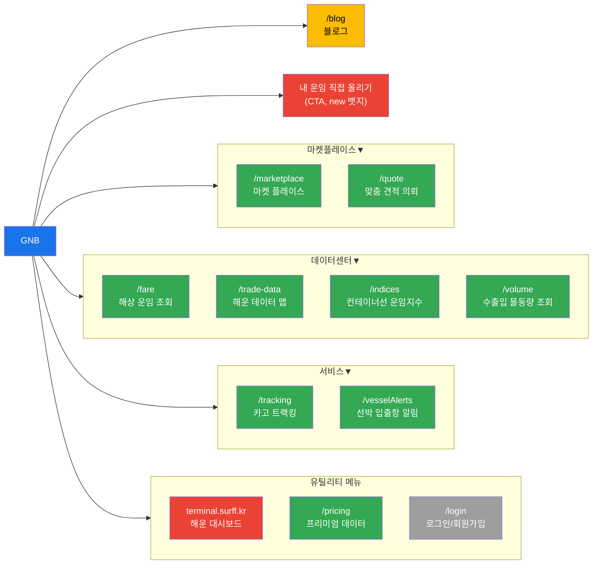
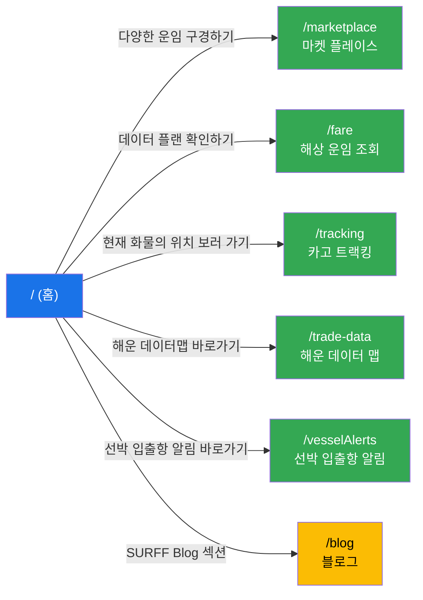
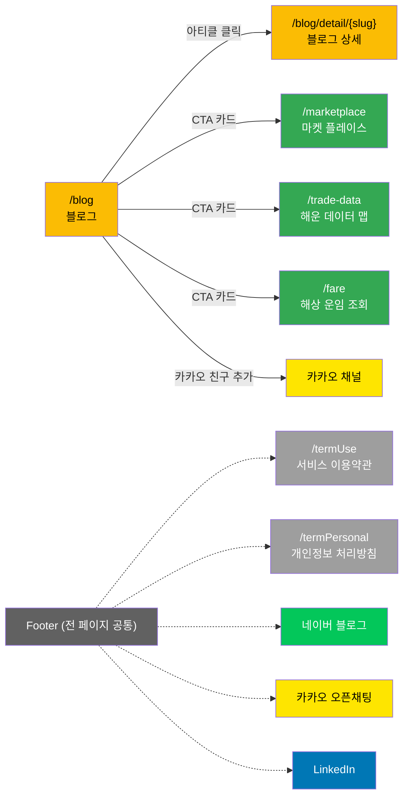

# surff.kr Visual Sitemap

**사이트**: [surff.kr](https://surff.kr)
**최종 업데이트**: 2026-02-05

---

## 1. 사이트 구조 (ASCII 트리)

```
surff.kr
│
├── / (홈)
│   ├── 히어로 슬라이더 (3개 배너)
│   ├── 해상 운임 조회 검색 폼 (3탭: 마켓플레이스, 운임추이, 카고트래킹)
│   ├── 핫딜 선복 카드 캐러셀
│   ├── SURFF Mission 섹션
│   ├── 서비스 소개 (마켓플레이스, 해운데이터맵, 선박입출항알림)
│   ├── Your Benefits with SURFF Company (3탭)
│   ├── SURFF Blog (최신 리포트 캐러셀)
│   └── SURFF Partners (파트너 로고 12개)
│
├── /marketplace (마켓 플레이스)
│   ├── 검색 폼 (컨테이너 타입, 출발지/도착지)
│   ├── 지역 필터 탭 (북미/중남미, 아시아/오세아니아, 유럽, 중동/아프리카)
│   └── 실시간 매칭 피드 캐러셀
│
├── /quote (맞춤 견적 의뢰)
│   ├── 견적 의뢰하기 폼
│   └── 전체 의뢰 내역 (미주/유럽/아시아/기타 지역 필터)
│
├── /fare (해상 운임 조회)
│   ├── 검색 폼 (컨테이너 유형/크기, POL, POD)
│   ├── 프리미엄 데이터 소개 섹션
│   ├── 실무형 데이터 포맷 (Sample Data)
│   ├── 파트너/선사 로고 배너
│   └── CTA "데이터 플랜 확인하기"
│
├── /indices (컨테이너선 운임지수)
│   ├── 기간 필터 (1개월/3개월/6개월/1년/3년/5년/전체)
│   └── PDF 다운로드
│
├── /volume (수출입 물동량 조회)
│   ├── 기간/국가 선택 폼
│   └── 물동량 데이터 테이블 (관세청 데이터 기반)
│
├── /tracking (카고 트랙킹)
│   ├── BL 등록 폼 (BL번호, 선사, 담당자)
│   ├── B/L 관리 (일괄등록, 엑셀 양식 다운로드, 내보내기)
│   └── 트랙킹 테이블 (BL, 선사, Vessel, 컨테이너, POL, POD, ETD, ETA, 상태, 담당자)
│
├── /vesselAlerts (선박 입출항 알림)
│   ├── 터미널 코드/모선명/터미널명 검색
│   ├── MY VESSEL (등록 선박 관리, 최대 10척)
│   └── 입출항 정보 테이블 (터미널명, 선사, 모선명, 항차, 반입마감시간, 접안예정일시, 출항예정일시, 상태)
│
├── /blog (블로그)
│   ├── 피처드 아티클 (대형 + 소형 3개)
│   ├── 카테고리 탭 (전체보기, 물류101, 주간 선사 동향, 데일리스크랩 등)
│   ├── 기사 검색 필터
│   ├── 아티클 목록 (카드) + 페이지네이션
│   ├── CTA 카드 (마켓플레이스, 해운데이터맵, 해상운임조회, 카카오)
│   ├── 뉴스레터 구독 섹션
│   └── /blog/detail/{slug} (블로그 상세 - 동적)
│
├── /trade-data (해운 데이터 맵)
│   ├── 검색 폼 (Port, POD)
│   ├── 주요 선사별 주가 추이 (1일/1주/1개월 차트)
│   ├── 해운 데이터맵 조회수 TOP 8 (Liner/Port 탭)
│   └── 인기 물류 뉴스
│
├── /pricing (프리미엄 데이터)
│   ├── 데이터 카테고리 탭 (해상운임, 무역 데이터)
│   │   ├── 해상운임: 부산발/상해발 구간별 해상운임
│   │   └── 무역 데이터: 기업별 컨테이너 수출 실적, HS CODE별 컨테이너 수출 실적, 컨테이너 선사별 물동량
│   ├── 3가지 플랜
│   │   ├── 데이터 즉시 다운로드 (Historical Data, Pay Now + 샘플)
│   │   ├── 데이터 구독 (Real-Time Data, Pay Now)
│   │   └── 웹 통합 및 API 연동 (Contact us + API Documentation)
│   └── 조회 폼 (시작일/종료일, POL, POD)
│
├── /login (로그인/회원가입)
│   ├── 이메일 인증 폼
│   └── 소셜 로그인 (NAVER, KAKAO, GOOGLE)
│
├── /termUse (서비스 이용약관)
│
└── /termPersonal (개인정보 처리방침)
```

---

## 2. 페이지 연결 관계 (Mermaid)

> 가독성을 위해 역할별 3개 다이어그램으로 분리하였습니다.

### 2-1. GNB 네비게이션 구조



### 2-2. 홈페이지 CTA 연결



### 2-3. 크로스 링크 & Footer



---

## 3. 페이지별 요약 테이블

| URL | 페이지명 | 주요 기능 | SEO 우선순위 | 변경 빈도 | 고유 메타 |
|-----|---------|----------|:----------:|:--------:|:---------:|
| `/` | 홈 | 서비스 허브, 운임 검색, 핫딜, 파트너 소개 | 1.0 | daily | O |
| `/marketplace` | 마켓 플레이스 - 운임비교 및 예약 | 운임 비교, 부킹 의뢰, 지역별 필터 | 0.9 | daily | O |
| `/quote` | 맞춤 견적 의뢰 | 견적 의뢰, 전체 의뢰 내역 (지역별 필터) | 0.7 | daily | O |
| `/fare` | 해상 운임 조회 | 해상 운임 추이 조회, 프리미엄 데이터 소개, 데이터 플랜 CTA | 0.8 | daily | O |
| `/indices` | 컨테이너선 운임지수 | SCFI, KCCI, CCFI 운임지수 조회, PDF 다운로드 | 0.7 | weekly | O |
| `/volume` | 수출입 물동량 조회 | 기간/국가별 수출입 물동량 (관세청 데이터) | 0.7 | monthly | O |
| `/tracking` | 카고 트랙킹 | BL 기반 화물 실시간 추적, B/L 관리 | 0.8 | daily | O |
| `/vesselAlerts` | 선박 입출항 알림 | 터미널 입출항 정보, MY VESSEL 일정 알림 | 0.7 | daily | O |
| `/blog` | 블로그 | 물류 동향, 카테고리별 아티클, 뉴스레터 | 0.7 | daily | O |
| `/trade-data` | 해운 데이터 맵 | 물동량 대시보드, 선사 주가, 인기 뉴스 | 0.7 | weekly | O |
| `/pricing` | 프리미엄 데이터 | 해상운임·무역 데이터 구독, 3가지 플랜, API 연동 | 0.7 | weekly | O |
| `terminal.surff.kr/en` | 해운 대시보드 (SURFF Terminal) | 실시간 운임, 선사 주가, 화물 추적 통합 터미널 (외부 서브도메인) | - | - | O |
| `/blog/detail/{slug}` | 블로그 상세 | 개별 아티클 콘텐츠 | - | 발행시 | 미확인 |
| `/login` | 로그인/회원가입 | 이메일 인증, 소셜 로그인 | - | rarely | X |
| `/termUse` | 서비스 이용약관 | 이용약관 (5장 25조) | - | rarely | X |
| `/termPersonal` | 개인정보 처리방침 | 개인정보 처리방침 (9개 조항) | - | rarely | X |

---

## 4. 공통 컴포넌트 맵

```
┌─────────────────────────────────────────────────────────────┐
│  Header                                                      │
│  ┌──────┐  ┌──────────────────────────────────┐  ┌────────────┐  │
│  │ SURFF │  │ GNB: 마켓플레이스▼ | 데이터센터▼ │  │ 해운대시보드│  │
│  │ Logo  │  │       | 서비스▼ | 블로그         │  │ 데이터구독  │  │
│  │ (→홈) │  │       | 내 운임 직접 올리기       │  │ KR | SignIn│  │
│  └──────┘  └──────────────────────────────────┘  └────────────┘  │
│                                                                    │
│  GNB 드롭다운 서브메뉴:                                             │
│  마켓플레이스▼: 마켓 플레이스, 맞춤 견적 의뢰                        │
│  데이터센터▼: 해상 운임 추이, 해운 데이터맵, 주요 지표, 수출입 물동량  │
│  서비스▼: 카고 트래킹, 선박 입출항 알림                               │
├─────────────────────────────────────────────────────────────┤
│                                                              │
│  ┌──────────────────────────────────────────────────────┐   │
│  │                    페이지 콘텐츠                       │   │
│  │                                                       │   │
│  │  ┌─────────────┐                   ┌──────────────┐  │   │
│  │  │ Notification │                   │   Booking     │  │   │
│  │  │  사이드바     │                   │  사이드바     │  │   │
│  │  │  (좌측)      │                   │  (우측)       │  │   │
│  │  └─────────────┘                   └──────────────┘  │   │
│  │                                                       │   │
│  │                                    ┌──────────────┐  │   │
│  │                                    │ 채팅/고객센터  │  │   │
│  │                                    │ (우하단 FAB)  │  │   │
│  │                                    └──────────────┘  │   │
│  └──────────────────────────────────────────────────────┘   │
│                                                              │
├─────────────────────────────────────────────────────────────┤
│  Footer                                                      │
│  ┌──────────────────────────────────────────────────────┐   │
│  │ 상단: 로고 | 서비스이용약관 | 개인정보처리방침          │   │
│  │ 중단: 네이버블로그 | 카카오오픈채팅 | LinkedIn           │   │
│  │       | 뉴스레터 구독 입력란                            │   │
│  │ 하단: 회사정보 (상호, 대표, 사업자번호, 주소 등)         │   │
│  │ COPYRIGHT ⓒ SURFF COMPANY Inc.                         │   │
│  └──────────────────────────────────────────────────────┘   │
└─────────────────────────────────────────────────────────────┘
```

### 공통 컴포넌트 상세

| 컴포넌트 | 위치 | 적용 범위 | 주요 요소 |
|---------|------|----------|----------|
| Header | 상단 고정 | 전 페이지 | SURFF 로고, GNB 5개 메뉴 (드롭다운 서브메뉴 포함), 유틸리티 메뉴 4개 |
| Footer | 하단 | 전 페이지 | 약관 링크, SNS 링크 3개, 뉴스레터 구독, 회사 정보 |
| Notification 사이드바 | 좌측 슬라이드 | 전 페이지 | 알림 검색, 알림 목록 |
| Booking 사이드바 | 우측 슬라이드 | 전 페이지 | FCL 정보, Booking 상태 관리 |
| 채팅/고객센터 | 우하단 FAB | 전 페이지 | 플로팅 버튼 |
| 언어 선택기 | Header 내 | 전 페이지 | KR / EN 전환 |
