# surff.kr Visual Sitemap

**사이트**: [surff.kr](https://surff.kr)
**최종 업데이트**: 2026-02-04

---

## 1. 사이트 구조 (ASCII 트리)

```
surff.kr
│
├── / (홈)
│   ├── 히어로 슬라이더 (3개 배너)
│   ├── 해상 운임 조회 검색 폼 (3탭: 마켓플레이스, 운임추이, 카고트래킹)
│   ├── 핫딜 선복 카드 캐러셀
│   ├── SURFF Mission 섹션
│   ├── 서비스 소개 (마켓플레이스, 해운데이터맵, 선박입출항알림)
│   ├── Your Benefits with SURFF Company (3탭)
│   ├── SURFF Blog (최신 리포트 캐러셀)
│   └── SURFF Partners (파트너 로고 12개)
│
├── /marketplace (마켓 플레이스)
│   ├── 검색 폼 (컨테이너 타입, 출발지/도착지)
│   ├── 지역 필터 탭 (북미/중남미, 아시아/오세아니아, 유럽, 중동/아프리카)
│   └── 실시간 매칭 피드 캐러셀
│
├── /fare (데이터 센터 - 해상 운임 추이)
│   ├── 검색 폼 (컨테이너 유형/크기, POL, POD)
│   ├── 데이터 센터 홍보 섹션
│   ├── 실무형 데이터 포맷 (Sample Data)
│   ├── 파트너/선사 로고 배너 (9개)
│   └── CTA "데이터 플랜 확인하기"
│
├── /tracking (카고 트래킹)
│   ├── BL 등록 폼 (BL번호, 선사, 담당자)
│   ├── B/L 관리 (일괄등록, 액셀 양식 다운로드, 내보내기)
│   └── 트래킹 테이블 (BL, 선사, Vessel, 컨테이너, POL, POD, ETD, ETA, 상태)
│
├── /blog (블로그)
│   ├── 피처드 아티클 (대형 + 소형 3개)
│   ├── 카테고리 탭 (전체보기, 물류101, 주간선사동향, 주간물류동향, 인사이드서프, 데일리스크랩)
│   ├── 기사 검색 필터
│   ├── 아티클 목록 (카드) + 페이지네이션
│   ├── CTA 카드 (마켓플레이스, 해운데이터맵, 해상운임조회, 카카오)
│   ├── 뉴스레터 구독 섹션
│   └── /blog/detail/{slug} (블로그 상세 - 동적)
│
├── /trade-data (해운 데이터 맵)
│   ├── 검색 폼 (Port, POD)
│   ├── 주요 선사별 주가 추이 (기간 필터)
│   ├── 해운 데이터맵 조회수 TOP 8 (Liner/Port 탭)
│   └── 인기 물류 뉴스
│
├── /login (로그인/회원가입)
│   ├── 이메일 인증 폼
│   └── 소셜 로그인 (NAVER, KAKAO, GOOGLE)
│
├── /termUse (서비스 이용약관)
│
└── /termPersonal (개인정보 처리방침)
```

---

## 2. 페이지 연결 관계 (Mermaid)

```mermaid
graph TD
    HOME["/ (홈)"]

    subgraph GNB["GNB 네비게이션"]
        MP["/marketplace<br/>마켓 플레이스"]
        FARE["/fare<br/>데이터 센터"]
        TRACK["/tracking<br/>카고 트래킹"]
        BLOG["/blog<br/>블로그"]
        MY_FARE["내 운임 직접 올리기<br/>(CTA 버튼, new 뱃지)"]
    end

    subgraph 유틸리티["유틸리티 메뉴"]
        TD_PAGE["/trade-data<br/>해운 데이터 맵"]
        LOGIN["/login<br/>로그인/회원가입"]
    end

    subgraph 법적고지["법적 고지"]
        TERM_USE["/termUse<br/>서비스 이용약관"]
        TERM_PERSONAL["/termPersonal<br/>개인정보 처리방침"]
    end

    subgraph 외부채널["외부 채널"]
        NAVER["네이버 블로그"]
        KAKAO_OPEN["카카오 오픈채팅"]
        LINKEDIN["LinkedIn"]
        KAKAO_CH["카카오 채널"]
    end

    BLOG_DETAIL["/blog/detail/{slug}<br/>블로그 상세"]

    %% 홈 → 서비스 CTA 연결
    HOME -->|"다양한 운임 구경하기"| MP
    HOME -->|"데이터 플랜 확인하기"| FARE
    HOME -->|"현재 화물의 위치 보러 가기"| TRACK
    HOME -->|"해운 데이터맵 바로가기"| TD_PAGE
    HOME -->|"SURFF Blog 섹션"| BLOG

    %% GNB/Footer는 전 페이지 공통이나, 다이어그램에서는 HOME 기준으로만 연결을 표현합니다.
    HOME --- GNB

    %% 블로그 → 블로그 상세
    BLOG -->|"아티클 클릭"| BLOG_DETAIL

    %% 블로그 CTA
    BLOG -->|"CTA 카드"| MP
    BLOG -->|"CTA 카드"| TD_PAGE
    BLOG -->|"CTA 카드"| FARE
    BLOG -->|"카카오 친구 추가"| KAKAO_CH

    %% Footer 연결 (전 페이지 공통)
    HOME -.->|"Footer"| TERM_USE
    HOME -.->|"Footer"| TERM_PERSONAL
    HOME -.->|"Footer"| NAVER
    HOME -.->|"Footer"| KAKAO_OPEN
    HOME -.->|"Footer"| LINKEDIN

    %% 유틸리티 메뉴 연결
    HOME ---|"유틸리티 메뉴"| LOGIN
    HOME ---|"유틸리티 메뉴"| TD_PAGE

    %% 스타일
    style HOME fill:#1a73e8,color:#fff
    style MP fill:#34a853,color:#fff
    style FARE fill:#34a853,color:#fff
    style TRACK fill:#34a853,color:#fff
    style BLOG fill:#fbbc04,color:#000
    style TD_PAGE fill:#34a853,color:#fff
    style LOGIN fill:#9e9e9e,color:#fff
    style TERM_USE fill:#9e9e9e,color:#fff
    style TERM_PERSONAL fill:#9e9e9e,color:#fff
    style BLOG_DETAIL fill:#fbbc04,color:#000
```



---

## 3. 페이지별 요약 테이블

| URL | 페이지명 | 주요 기능 | SEO 우선순위 | 변경 빈도 | 고유 메타 |
|-----|---------|----------|:----------:|:--------:|:---------:|
| `/` | 홈 | 서비스 허브, 운임 검색, 핫딜, 파트너 소개 | 1.0 | daily | O |
| `/marketplace` | 마켓 플레이스 | 운임 비교, 부킹 의뢰, 지역별 필터 | 0.9 | daily | O |
| `/fare` | 데이터 센터 | 해상 운임 추이 조회, 데이터 구독 | 0.8 | daily | O |
| `/tracking` | 카고 트래킹 | BL 기반 화물 실시간 추적, B/L 관리 | 0.8 | daily | O |
| `/blog` | 블로그 | 물류 동향, 카테고리별 아티클, 뉴스레터 | 0.7 | daily | O |
| `/trade-data` | 해운 데이터 맵 | 물동량 대시보드, 선사 주가, 인기 뉴스 | 0.7 | weekly | O |
| `/blog/detail/{slug}` | 블로그 상세 | 개별 아티클 콘텐츠 | - | 발행시 | 미확인 |
| `/login` | 로그인/회원가입 | 이메일 인증, 소셜 로그인 | - | rarely | X |
| `/termUse` | 서비스 이용약관 | 이용약관 (5장 25조) | - | rarely | X |
| `/termPersonal` | 개인정보 처리방침 | 개인정보 처리방침 (9개 조항) | - | rarely | X |

---

## 4. 공통 컴포넌트 맵

```
┌─────────────────────────────────────────────────────────────┐
│  Header                                                      │
│  ┌──────┐  ┌─────────────────────────────┐  ┌────────────┐  │
│  │ SURFF │  │ GNB: 마켓플레이스 | 데이터센터│  │ 해운대시보드│  │
│  │ Logo  │  │       | 서비스 | 블로그     │  │ 데이터구독  │  │
│  │ (→홈) │  │       | 내 운임 직접 올리기  │  │ KR | SignIn│  │
│  └──────┘  └─────────────────────────────┘  └────────────┘  │
├─────────────────────────────────────────────────────────────┤
│                                                              │
│  ┌──────────────────────────────────────────────────────┐   │
│  │                    페이지 콘텐츠                       │   │
│  │                                                       │   │
│  │  ┌─────────────┐                   ┌──────────────┐  │   │
│  │  │ Notification │                   │   Booking     │  │   │
│  │  │  사이드바     │                   │  사이드바     │  │   │
│  │  │  (좌측)      │                   │  (우측)       │  │   │
│  │  └─────────────┘                   └──────────────┘  │   │
│  │                                                       │   │
│  │                                    ┌──────────────┐  │   │
│  │                                    │ 채팅/고객센터  │  │   │
│  │                                    │ (우하단 FAB)  │  │   │
│  │                                    └──────────────┘  │   │
│  └──────────────────────────────────────────────────────┘   │
│                                                              │
├─────────────────────────────────────────────────────────────┤
│  Footer                                                      │
│  ┌──────────────────────────────────────────────────────┐   │
│  │ 상단: 로고 | 서비스이용약관 | 개인정보처리방침          │   │
│  │ 중단: 네이버블로그 | 카카오오픈채팅 | LinkedIn           │   │
│  │       | 뉴스레터 구독 입력란                            │   │
│  │ 하단: 회사정보 (상호, 대표, 사업자번호, 주소 등)         │   │
│  │ COPYRIGHT ⓒ SURFF COMPANY Inc.                         │   │
│  └──────────────────────────────────────────────────────┘   │
└─────────────────────────────────────────────────────────────┘
```

### 공통 컴포넌트 상세

| 컴포넌트 | 위치 | 적용 범위 | 주요 요소 |
|---------|------|----------|----------|
| Header | 상단 고정 | 전 페이지 | SURFF 로고, GNB 5개 메뉴, 유틸리티 메뉴 4개 |
| Footer | 하단 | 전 페이지 | 약관 링크, SNS 링크 3개, 뉴스레터 구독, 회사 정보 |
| Notification 사이드바 | 좌측 슬라이드 | 전 페이지 | 알림 검색, 알림 목록 |
| Booking 사이드바 | 우측 슬라이드 | 전 페이지 | FCL 정보, Booking 상태 관리 |
| 채팅/고객센터 | 우하단 FAB | 전 페이지 | 플로팅 버튼 |
| 언어 선택기 | Header 내 | 전 페이지 | KR / EN 전환 |
